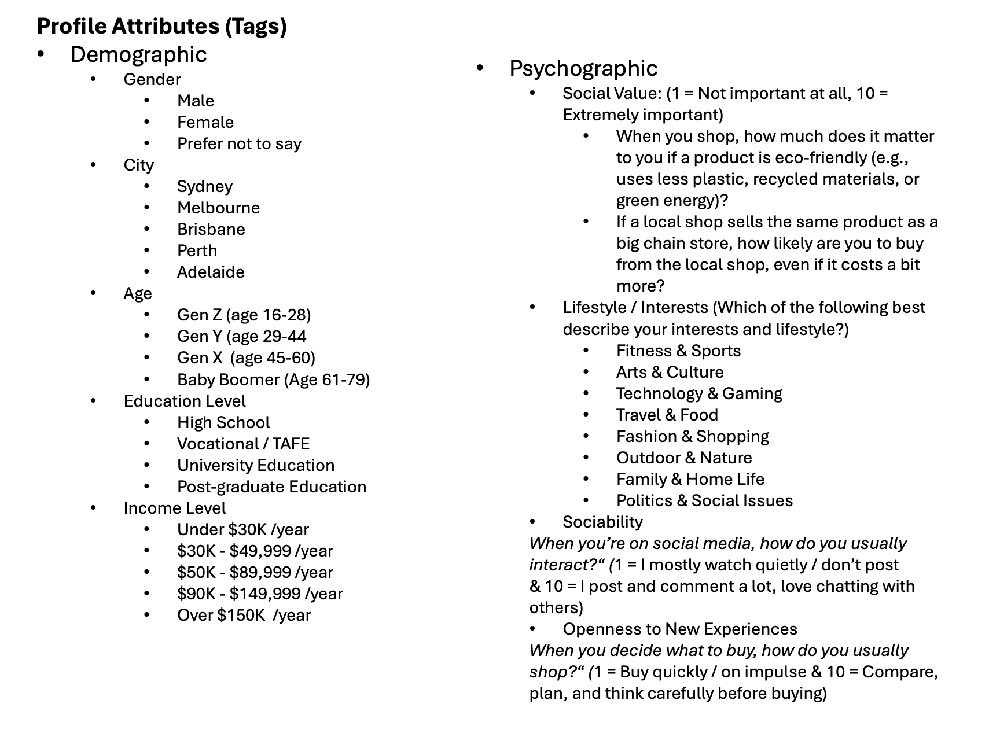
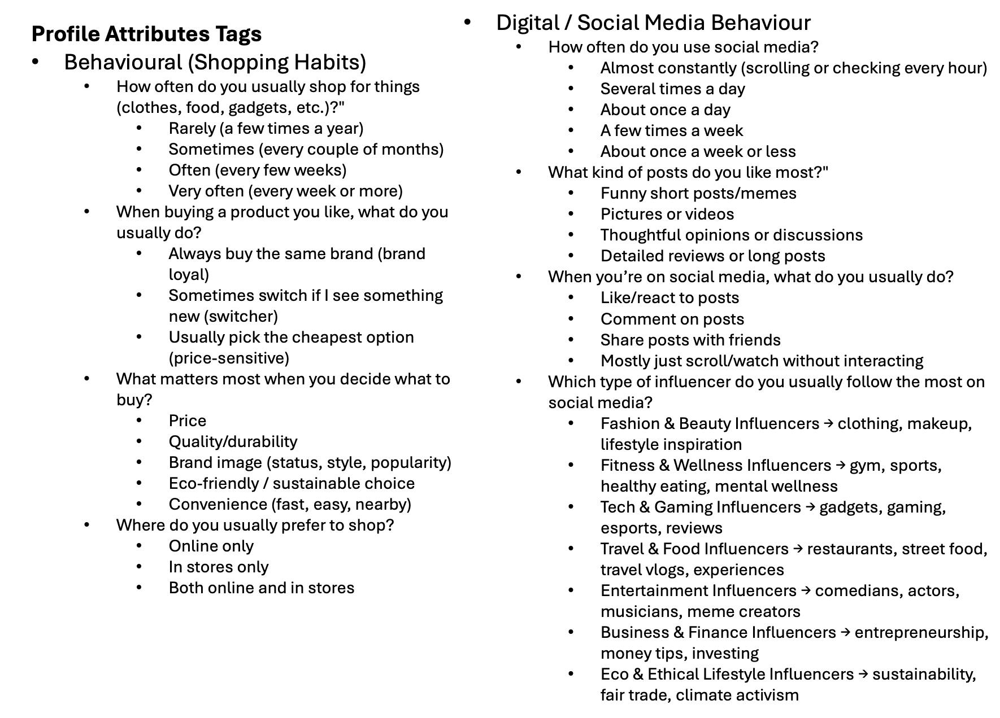

Use an email in the format `z5490612@ad.unsw.edu.au`(or any other email of AU university) to sign up. Send a 4-digit verification code to that inbox, verify it, then allow the user to set a password. After the password is saved, log the user in automatically and redirect to the **Complete Your Profile** page. The profile should be filled out through a survey-style form, matching the two mock-ups below.

Users are separated by roles. There is a super-admin (teacher). After a user signs up I can manually change their role in the database to super-admin. Ordinary users are students. A super-admin can promote a student to an admin.

The platform also needs virtual users that will later like or comment on posts. These personas should also live in the `users` table even though they do not have real email addresses or zIDs.

Do not allow the same email address to request a verification code more than once within 60 seconds. Codes expire after 5 minutes. Use Redis to enforce the throttle. Codes are 4 digits.

After logging in, show a page that lists all “term–course” pairs the user has joined (see mock-up). Provide another entry point that lists *all* available term–course combinations so students can join new ones. Term–course records are created by teachers/admins, e.g. term `2025T2` and course `COMP9313`. Each term–course has a start and end date; once it ends it becomes read-only (no new posts or replies). Each term–course must have a join code set by the teacher so that students can validate themselves. After joining, students can see the posts. The home page is an infinite-scrolling feed with **For You** and **Following** tabs.

Teacher accounts need an entry point that lets them create new terms and courses.

Inside a course, the home page is that same infinite feed with **For You** and **Following** tabs. Each card shows the author’s name, avatar, timestamp, post text, media if present, counts for comments and likes, plus a `...` menu to follow the author. Clicking a post opens the detail page with the same information plus the comments list (each comment shows commenter name, avatar, and timestamp). Post content must support `#hashtags` and `@mentions`, and replies should be allowed for individual comments.

User profiles should show name, avatar, bio, email, number of posts, following count, and follower count, followed by their historical posts. On your own profile you can edit avatar, name, bio, and gender. When viewing someone else’s profile there should be a **Follow** button.

Design a hashtag landing page. Clicking a `#hashtag` inside a post should open a detail page that lists all posts within the same term–course that include that tag. The list is infinite scrolling with three tabs: **All**, **Latest**, and **Hottest**.

Add a post-level analytics view. From your own post detail page, provide an entry point to “View Analytics”, which shows total views, interactions, positive comment count, and negative comment count.

Extend the notification system. Likes, replies, follows, and mentions must all generate messages. The frontend needs a notification inbox entry (showing an unread badge). Opening it should display the detailed notifications. Keep an eye out for any other scenarios that should trigger notifications.
