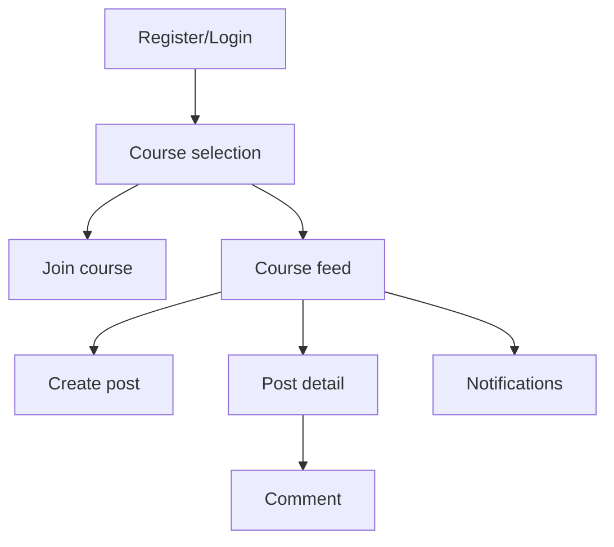
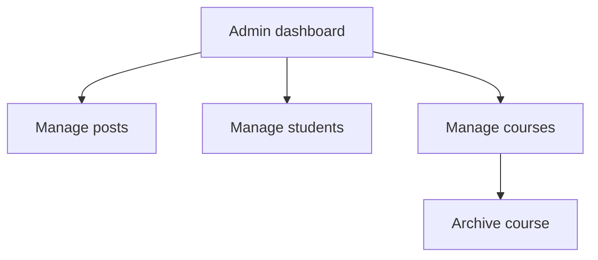
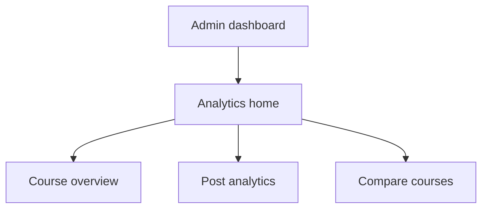

Below are the three Sprint requirement documents for the **In-House Social Media Simulation Platform**.  


# Sprint 1 — Core Foundation (W3–W5)

> Theme: Student identity + course enrolment + social basics (posts, comments, likes)

##  Goals

1. Complete registration / login / email OTP / Forgot Password flows.
2. Teachers can create term courses and auto-generate join codes.
3. Students can enter a join code to enrol in a course.
4. Students can post, comment, like inside a course and receive notifications.

##  Pages & Flows

### Registration / Login / Password Management

| Page              | Purpose                                                                      | Notes                                |
| ----------------- | ---------------------------------------------------------------------------- | ------------------------------------ |
| `/register`       | Enter UNSW email (`zID@unsw.edu.au`), send verification code                 | Code valid 5 min, Redis rate limit 60s |
| `/verify-email`   | Verify code then redirect to password page                                   |                                      |
| `/set-password`   | Save password → auto-register → redirect to login                            |                                      |
| `/login`          | JWT login → redirect `/courses`                                              |                                      |
| `/reset-password` | Forgot password → send OTP → reset                                           |                                      |

**APIs**

| Endpoint                           | Method | Body / Params                    | Response                           | Notes        |
| ---------------------------------- | ------ | -------------------------------- | ---------------------------------- | ------------ |
| `/api/auth/send-code/`             | POST   | `{email}`                        | `{success}`                        | Redis throttle |
| `/api/auth/register/`              | POST   | `{email, code, password}`        | `{token, userId}`                  | Register + login |
| `/api/auth/login/`                 | POST   | `{email, password}`              | `{access, refresh, userInfo}`      | JWT tokens   |
| `/api/auth/reset-password/send/`   | POST   | `{email}`                        | `{success}`                        |              |
| `/api/auth/reset-password/confirm/`| POST   | `{email, code, newPassword}`     | `{success}`                        |              |

### Course Management (Join & Create)

| Page              | Description                                     |
| ----------------- | ----------------------------------------------- |
| `/courses`        | List courses already joined                     |
| `/courses/join`   | Student enters join_code                        |
| `/courses/create` | Teacher creates course (name, term, dates, code)|

**APIs**

| Endpoint              | Method | Body                                  | Response                             |
| --------------------- | ------ | ------------------------------------- | ------------------------------------ |
| `/api/courses/`       | GET    | —                                     | `[ {id,name,term,is_archived} ]`     |
| `/api/courses/join/`  | POST   | `{joinCode}`                          | `{courseId, success}`                |
| `/api/courses/`       | POST   | `{name,term,startDate,endDate}`       | `{courseId, joinCode}`               |

**SQL**

```sql
CREATE TABLE users (
  id SERIAL PRIMARY KEY,
  zid VARCHAR(20),
  email VARCHAR(100) UNIQUE NOT NULL,
  password_hash TEXT NOT NULL,
  role VARCHAR(20) DEFAULT 'student',
  created_at TIMESTAMP DEFAULT NOW()
);

CREATE TABLE courses (
  id SERIAL PRIMARY KEY,
  name VARCHAR(100) NOT NULL,
  term VARCHAR(20) NOT NULL,
  join_code VARCHAR(10) UNIQUE NOT NULL,
  start_date DATE NOT NULL,
  end_date DATE NOT NULL,
  is_archived BOOLEAN DEFAULT FALSE,
  created_by INT REFERENCES users(id)
);

CREATE TABLE course_members (
  id SERIAL PRIMARY KEY,
  user_id INT REFERENCES users(id),
  course_id INT REFERENCES courses(id),
  role VARCHAR(20) DEFAULT 'student',
  joined_at TIMESTAMP DEFAULT NOW(),
  UNIQUE(user_id, course_id)
);
```

### Feed + Interaction

| Page                      | Functionality                                  |
| ------------------------- | ---------------------------------------------- |
| `/courses/:id/feed`       | For You / Following tabs, infinite scroll feed |
| `/courses/:id/create-post`| Compose post (text + media)                    |
| `/posts/:id`              | Post detail with comments + likes              |

**APIs**

| Endpoint                      | Method | Params / Body                         | Response         |
| ----------------------------- | ------ | ------------------------------------- | ---------------- |
| `/api/posts/feed`             | GET    | `?courseId=&tab=&cursor=`             | Post list        |
| `/api/posts/`                 | POST   | `{content, courseId, ossKeys:[]}`     | `{postId}`       |
| `/api/posts/:id/like`         | POST   | —                                     | `{likeCount}`    |
| `/api/posts/:id/comments`     | GET    | `?page=`                              | Comments         |
| `/api/posts/:id/comments`     | POST   | `{content,parentId?}`                 | `{commentId}`    |

**SQL**

```sql
CREATE TABLE posts (
  id SERIAL PRIMARY KEY,
  user_id INT REFERENCES users(id),
  course_id INT REFERENCES courses(id),
  content TEXT,
  media JSONB,
  like_count INT DEFAULT 0,
  comment_count INT DEFAULT 0,
  created_at TIMESTAMP DEFAULT NOW()
);

CREATE TABLE post_likes (
  id SERIAL PRIMARY KEY,
  user_id INT REFERENCES users(id),
  post_id INT REFERENCES posts(id),
  created_at TIMESTAMP DEFAULT NOW(),
  UNIQUE(user_id, post_id)
);

CREATE TABLE comments (
  id SERIAL PRIMARY KEY,
  user_id INT REFERENCES users(id),
  post_id INT REFERENCES posts(id),
  content TEXT,
  parent_comment_id INT REFERENCES comments(id),
  created_at TIMESTAMP DEFAULT NOW()
);
```

### Notifications (v1)

Likes and comments trigger notifications.

```sql
CREATE TABLE notifications (
  id SERIAL PRIMARY KEY,
  recipient_id INT REFERENCES users(id),
  actor_id INT REFERENCES users(id),
  type VARCHAR(20),
  message TEXT,
  is_read BOOLEAN DEFAULT FALSE,
  created_at TIMESTAMP DEFAULT NOW()
);
```

**APIs**

| Endpoint                             | Method | Response     |
| ------------------------------------ | ------ | ------------ |
| `/api/notifications/unread-count`    | GET    | `{count}`    |
| `/api/notifications`                 | GET    | Notification list |
| `/api/notifications/:id/read`        | POST   | `{success}`  |

### Flow Diagram



### Milestones

| Week | Focus                   | Deliverable            |
| ---- | ----------------------- | ---------------------- |
| W3   | Registration / OTP      | Account system         |
| W4   | Courses (join/create)   | Course structure       |
| W5   | Posting / comments      | First social loop      |

---

#  Sprint 2 — Admin Moderation & Course Lifecycle (W5–W8)

> Theme: Teacher console + content moderation + course lifecycle management

##  Goals

1. Teachers can delete abusive posts and ban students.
2. Teachers configure course start/end and auto-archive when ended.
3. Archived courses are read-only (no posting/editing).

##  Pages & Flows

| Page               | Purpose            |
| ------------------ | ------------------ |
| `/admin/dashboard` | Teacher home       |
| `/admin/posts`     | Review/delete posts|
| `/admin/users`     | View/ban students  |
| `/admin/courses`   | Manage course list |

###  Post moderation

| Endpoint                           | Method  | Description          |
| ---------------------------------- | ------- | -------------------- |
| `/api/admin/posts`                 | GET     | List posts by status |
| `/api/admin/posts/:id/delete`      | DELETE  | Soft delete          |

```sql
ALTER TABLE posts ADD COLUMN is_deleted BOOLEAN DEFAULT FALSE;
```

###  Student bans

| Endpoint                               | Method | Description   |
| -------------------------------------- | ------ | ------------- |
| `/api/admin/users`                     | GET    | List students |
| `/api/admin/users/:id/ban`             | POST   | `{ban:true}`  |

```sql
ALTER TABLE users ADD COLUMN is_banned BOOLEAN DEFAULT FALSE;
```

###  Course archiving

| Endpoint                        | Method | Body         |
| ------------------------------- | ------ | ------------ |
| `/api/courses/:id/archive`      | POST   | `{endDate}`  |

### Flow Diagram



### Milestones

| Week | Focus                  | Deliverable                |
| ---- | ---------------------- | -------------------------- |
| W6   | Moderation             | Post deletion              |
| W7   | Course schedule        | Start/end management       |
| W8   | Ban + read-only logic  | Complete teacher console   |

---

#  Sprint 3 — Analytics Dashboard (W8–W10)

> Theme: Data analytics + visualization + docs/demo readiness

##  Goals

1. Teachers can view post-level and course-level analytics.
2. Support trends, sentiment, and engagement statistics.
3. Finish documentation and QA demo prep.

##  Pages & Flows

| Page                    | Purpose             |
| ----------------------- | ------------------- |
| `/analytics`            | Choose course overview |
| `/analytics/posts/:id`  | Post analytics      |
| `/analytics/compare`    | Course/time comparison |

###  Course dashboard

**Metrics**

- Total posts
- Active students
- Avg engagement (likes + comments)
- Timeline chart

`GET /api/analytics/course/:id` → `{totalPosts, activeUsers, engagementRate, timeline}`

### Post dashboard

**Metrics**

- Views / likes / comments
- Positive vs negative sentiment
- Avg engagement rate

`GET /api/analytics/post/:id` → `{views, likes, comments, posFeedback, negFeedback}`

**SQL**

```sql
CREATE TABLE post_analytics (
  post_id INT PRIMARY KEY REFERENCES posts(id),
  view_count INT DEFAULT 0,
  pos_feedback INT DEFAULT 0,
  neg_feedback INT DEFAULT 0,
  last_updated TIMESTAMP DEFAULT NOW()
);
```

###  Comparison

`GET /api/analytics/compare?type=course|time&id1=&id2=` → returns two sets of metrics.

### Flow Diagram



### Milestones

| Week | Focus                     | Deliverable                |
| ---- | ------------------------ | -------------------------- |
| W9   | Analytics development    | Course + post dashboards   |
| W10  | Docs + Final demo + QA   | Project wrap-up            |

---

# Summary Table

| Sprint | Theme                        | Core modules                | Outcome                |
| ------ | ---------------------------- | --------------------------- | ---------------------- |
| 1      | Auth / Courses / Feed        | Auth + Courses + Feed       | Functional social loop |
| 2      | Admin tooling                | Moderation + archive + bans | Teacher-ready backend  |
| 3      | Analytics & optimisation     | Dashboard + docs            | Insight & delivery     |

---

Need a **three-stage architecture + data-flow diagram**?  
Happy to prepare it for the “System Architecture Evolution per Sprint” section whenever required.
